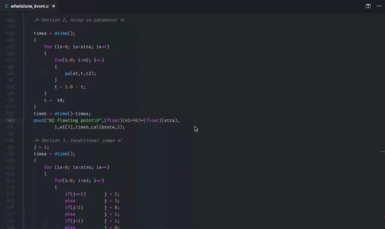

# Disassembly Explorer

Shows disassembly to source relations and dims unused source lines.

This extension is based on [Compiler Explorer](https://github.com/mattgodbolt/compiler-explorer) (especially on AsmParser class from it).



## Usage

First you need disassembly of your source files. That's because the extension does not know anything about your project structure, compiler and compilation flags.

Regular disassembly may be generated with:

    $(CC) -g -o disassembly.S $(CFLAGS) -S source.c

Objdumped disassembly should be generated with lines info:

    objdump -d compiled.bin -l > disassembly.S

When you don't want to specify the output file manually (or use e.g. CMake or build scripts) and compile with GCC, you can use the [-save-temps option](https://gcc.gnu.org/onlinedocs/gcc/Developer-Options.html). This will put a `source.s` file into the output directory. Compile with:

    $(CC) -g -save-temps $(CFLAGS) source.c

Next, when you generated disassembly, you should tell the extension where to search for it. By default it is expected right next to the source file, but with `.S` extension:

```json
"disasexpl.associations": {
    "**/*.c": "${fileDirname}/${fileBasenameNoExtension}.S",
    "**/*.cpp": "${fileDirname}/${fileBasenameNoExtension}.S"
}
```
Make sure to adjust the disassembly extension to `.s` when using the "-save-temps" option.

Now, when all is done, simply select `F1 > Disassembly Explorer: Show`. Disassembly will be opened on the right side of your source.

## TODO

- [ ] Provide links for lines like `ja 24a7 <rasterize+0x7d7>`
- [ ] Colorize source and asm lines as in Compiler Explorer
